# Assignment 2

## Repository Link

[https://github.com/bgottlob/app-sec-assignment2](https://github.com/bgottlob/app-sec-assignment2)

## Key Design Decisions

### Use of jinja2 Templates

The web server uses the [Jinja2](https://jinja.palletsprojects.com/en/2.11.x/) templating engine to render HTML.
Jinja2 is the default templating engine for Flask, and by default Flask configures templates to escape all values inserted into templates.
The default escaping prevents JavaScript command injection into user input fields from causing cross-site scripting attacks.

Perhaps the riskiest use of templates is in the registration form:

``` html
Username: <input id="uname" name="uname" type="text" value="{{ username }}" required/>
Password: <input id="pword" name="pword" type="password" value="{{ password }}" required/>
Cellphone Number: <input id="2fa" name="2fa" type="text"/ value="{{ mfa }}" required/>
```

The `username`, `password`, and `mfa` variables are rendered back into the `value` attributes of the form in cases where the user tries to register with a username that is already taken.
This keeps the user-entered values in the form when the error message is returned, and provides a convenience to the user.
This is of relatively low-risk, the `value` attribute is escaped in double quotes per the [OWASP recommendation](https://github.com/OWASP/CheatSheetSeries/blob/master/cheatsheets/Cross_Site_Scripting_Prevention_Cheat_Sheet.md#rule-2---attribute-escape-before-inserting-untrusted-data-into-html-common-attributes).


Another somewhat risky use of templates is the use of the `category` variable in the `appsec/templates/layout.html` template:

``` html
<li id="{{ category }}">{{ message }}</li>
```

This is still very low-risk, since the `category` is only set one of the two hard-coded values `success` or `result`, and the attribute is escaped in double quotes.

All template interpolation of the `href` attribute of `<a>` tags are likewise filled only with trusted values generated by Flask's `url_for` function:

``` html
<a href="{{ url_for('auth.register') }}">Register</a>
```

There are no templates that insert untrusted data into HTML comments, attribute names, tag names, CSS, or inside `<script>` tags.
Besides the examples above, all template variables are inserted into the content portion of tags that display text, such as `<li>` and `<p>`

### Password Hashing and Salting

User credentials are stored in memory on the Flask web server using a dictionary.
The key of the dictionary is the user's username which maps to a sub-dictionary containing the user's password and multi-factor authentication phone number.
If the operating system the Flask server is running in is ever compromised, an attacker can possibly inspect the contents of memory and see the stored credentials for all users.
It is not important to obscure the user's phone number, however, it is very important to ensure an attacker cannot read users' passwords.
To do this, passwords are hashed and salted using the python `hashlib` implementation of PBKDF2 key derivation function.
The salt is a randomly generated string and is additionally stored in the user credentials dictionary in order to verify user-supplied passwords when login attempts are made.
Salting prevents the same password from generating the same hash if multiple users use the same password.
In real-world scenarios, this is probable, so salting can make it more difficult to derive passwords from examination of hashes.
As a general consensus, 100,000 iterations of key stretching is recommended, so that is what is used

### Security Headers

The Flask documentation provides [excellent recommendations](https://flask.palletsprojects.com/en/1.1.x/security/#security-headers) for setting specific HTTP headers for additional security, many of which are adopted in the `add_response_headers` method located in the `appsec/__init__.py` file.
This method adds headers to the responses just before they are sent to users' browsers.
Thanks to the small required feature set of the web server, many of the HTTP headers can be set to very strict configurations.

``` python
response.headers['Strict-Transport-Security'] = 'max-age=31536000; includeSubDomains'
```

The `Strict-Transport-Security` header forces the browser to load the website using HTTPS if the server supports HTTPS.
In cases where the server running Flask has a properly configured TLS certificate and forces redirects to HTTPS, this prevents many types of man-in-the-middle attacks.
In cases where the server can serve content over HTTP, this header is ignored.

``` python
response.headers['Content-Security-Policy'] = "default-src 'self'"
```

This specific value for the `Content-Secuirity-Policy` header sets a policy that all objects such as JavaScript, CSS, fonts, and images can only be loaded from the Flask web server.
No external resources are allowed, which does not affect any functionality of the website.
This helps prevent loading of malicious DOM objects from untrusted sources.

``` python
response.headers['X-Content-Type-Options'] = 'nosniff'
response.headers['Content-Type'] = 'text/html; charset=UTF-8'
```

The `nosniff` value for the `X-Content-Type-Options` header forces the browser to use the value of the `Content-Type` header, rather than attempting to detect the proper content type.
Spoofed content types is a common vector for cross-site scripting attacks, and these settings mitigate misuse of content type.

``` python
response.headers['X-Frame-Options'] = 'DENY'
```

The `DENY` value for `X-Frame-Options` prevents _all_ websites, external or on the same domain, from embedding this website in an `iframe`.
This prevents clickjacking attacks, where a victim visits a malicious website, legitimate website content is hidden in an `iframe`, and the victim is tricked into clicking on a button without realizing the victim has just clicked on a button of a legitimate website.

``` python
response.headers['X-XSS-Protection'] = '1; mode=block'
```

The `X-XSS-Protection` header prevents many reflected cross-site scripting attacks by telling the browser to refuse to load the webpage if the request for it contains JavaScript.
This is usually a guess on the browser's part, since it needs to guess whether a request looks like JavaScript command injection.
This will prevent simple attacks, such as ones where JavaScript code can be accepted as a query parameter in the URL.
There are no such routes that accept user input on this Flask server, but this is a low-cost additional security measure, so I have added it anyway.

### Session Management

Session management is performed using Flask's standard [session API](https://flask.palletsprojects.com/en/1.1.x/quickstart/#sessions), which is an implementation of cryptographically signed cookies.
When a user logs in, the browser receives an HTTP response with the `Set-Cookie` header set with a token that encodes data about the session.
The only data stored here is the user's username and a flag to indicate that the Flask session is "permanent".

These are the configuration settings in the Flask app related to cookies:

``` python
app.config.update(
	SECRET_KEY = secret_key,
        # Uncomment the line below when using HTTPS
	#SESSION_COOKIE_SECURE = True,
	SESSION_COOKIE_HTTPONLY = True,
	SESSION_COOKIE_SAMESITE = 'Strict',
	PERMANENT_SESSION_LIFETIME = 900, # 15 minutes of inactivity
	SESSION_REFRESH_EACH_REQUEST = True
)
```

The `SECRET_KEY` is a key known only by the server used to cryptographically sign and verify the validity cookies.
This can be set using an environment variable, otherwise it is set to a random byte sequence on server startup.
The secret key prevents an attacker from modifying the contents of a cookie to attempt to be authenticated as a different user.

`SESSION_COOKIE_SECURE = True` only allows cookies to be sent over HTTPS when the server host is configured to run over HTTPS.
This is currently commented out since, for the purposes of this assignment, the server is only running locally over HTTP.
If hosted on a real production server, content should be served over HTTPS with a properly configured TLS certificate and with this line uncommented to use secure cookies over HTTPS.
Chromium will block cookies with the `Secure` header that are sent over HTTP, which is my reasoning for commenting this line out for this assignment.

`SESSION_COOKIE_HTTPONLY = True` prevents cookies from being read by client-side JavaScript code.
This prevents cross-site scripting attack code from accessing the cookie using `document.cookie` and potentially sending it to an attacker's server.

By default, Flask sessions are "volatile", meaning they will not expire until a user explicitly logs out.
Volatile session cookies do not have an expiration date, meaning if an attacker steals the cookie, the attacker can utilize it at any point in the future if the user does not explicitly log out.
This Flask server uses "permanent" sessions, which define an expiration date for the cookie.
`PERMANENT_SESSION_LIFETIME = 900` sets the expiration of the cookie to 15 minutes.
`SESSION_REFRESH_EACH_REQUEST = True` refreshes the expiration date each time the user makes a request to the server.
This means that a user's session will expire after 15 minutes of inactivity.
This is not a flawless defense against stolen cookies, but it gives the attacker a smaller time period to steal and use a cookie without sacrificing usability of the application.

`SESSION_COOKIE_SAMESITE = 'Strict'` only allows cookies to be sent in first-party requests, meaning external sites cannot send requests with cookies to the Flask server.
This prevents many classes of cross-site request forgery attacks.

### Restrictive Permissions on Files Checked for Spelling

Due to the way the C spell check program works, the user's input to be checked must be supplied in a plain text file.
For standardization purposes, the provided `a.out` file is used in this assignment.
It is assumed that the fuzzing performed in [Assignment 1](https://github.com/bgottlob/app-sec-assignment1) protects the C executable from many classes of vulnerabilities that could be caused by placing unexpected characters or large numbers of characters in input files.
However, the manner in which the files are created and stored on the server's file system are potential attack vectors.

When a user sends text over the input form, an [RFC 4122-compliant](https://tools.ietf.org/html/rfc4122.html) UUID is created and converted to a hex string.
This UUID string plus a `.txt` extension is used as the filename for the file to store the user input and pass to the C executable.
Besides being a decent way to handle concurrent requests to the `/checkWords` route, utilizing a UUID prevents the need to use untrusted user input, such as the username, as a filename.
This prevents potential OS-level filename exploits from occurring.
The `.txt` extension is used to prevent OS-level vulnerabilities due to misinterpretation of the content type of files, though this is not a huge security benefit alone.

A malicious user can potentially use the free text field to send exploitation code to the web server.
For this reason, as well as to minimize disk storage usage, the user input files are deleted directly after the C executable has identified the misspelled words in the file.
Just in case there are user input files persisting after a response is sent, the `appsec/userinput` directory used to store the input files is removed and re-created when the Flask server starts.
This would require an attacker to load the code into the server's memory as soon as input is sent, which makes this vector of attack more difficult to exploit.
An attacker cannot upload exploit code then try to trigger it later.

A final security consideration here is that the input files are created with the `w` file mode passed to the `open` function.
This will only allow reading and writing of the file.
If an attacker wanted the web server's OS to execute malicious code stored one of these files, the attacker would need to perform privilege escalation then manually change the file permissions.

\newpage

## Attack Attempts

### Stored Cross-Site Scripting

There are two places where user input is stored in Flask server memory then displayed in the browser: the username and spell check text output. I attempted to inject two encodings of a script to print the cookie value in an alert:

``` html
&quot;&gt;&lt;script&gt;alert(document.cookie)&lt;/script&gt;
%22%3E%3Cscript%3Ealert(document.cookie)%3C%2Fscript%3E
```

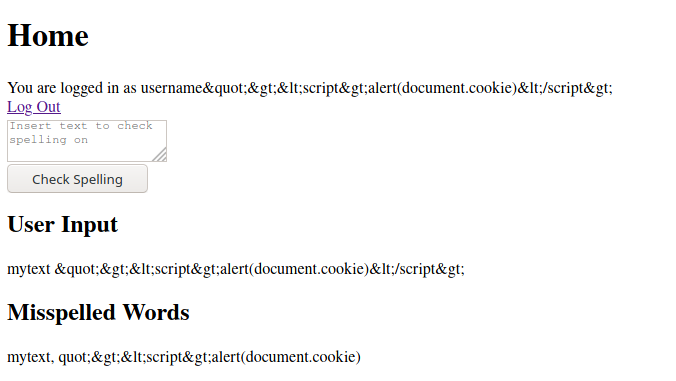{ width=50% }
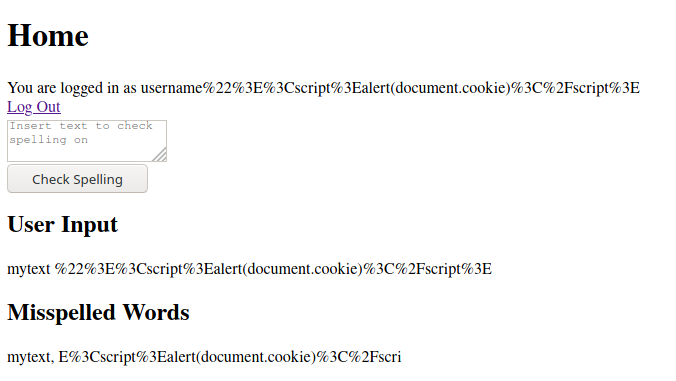{ width=50% }

Both attempts show that the username and output text displays are not vulnerable to stored cross-site scripting attacks.
This demonstrates the advantages of utilizng the Jinja2 templating engine with Flask's default configuration.

\newpage

### Reflected Cross-Site Scripting

To test for reflected cross-site scripting, I attempted to attack what I consider to be the riskiest usage of templating in my application, on the registration page:

``` html
Cellphone Number: <input id="2fa" name="2fa" type="text" value="{{ mfa }}" required/>
```

When registration fails due to a username being taken already, the `mfa` variable is reflected back to the user in the value attribute of the form.
I attempted to place the following string

As can be seen in the screenshot of the rendered DOM, this does not break out of the value attribute and allow an attacker to set other attributes on that field:

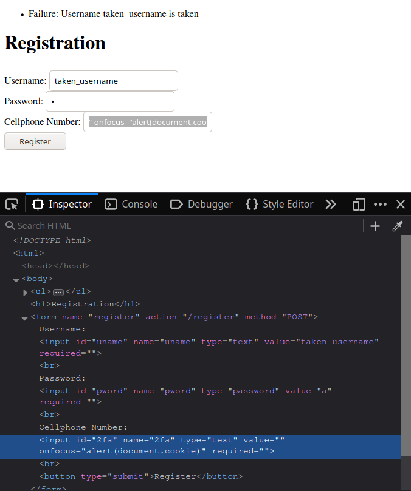{ width=50% }

This is prevented by escaping the interpolated variable in the template with double quotes.

I also attempted reflected cross-site scripting by placing `<script>` tags within a URL.
Ahead of time, I know this will only result in 404 errors, since there is no variable matching performed within URLs in any of my routes.

Here is the result of trying to call the route:
```
http://localhost:5000/spell_check/<script>alert(document.cookie)</script>`
```

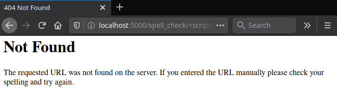{ width=50% }

\newpage

### Clickjacking

To test for clickjacking, I created an HTML file `report/clickjacking_test.html` containing the following HTML, which attempts to load the homepage from the running Flask server in an `iframe`:

``` html
<html>
  <head>
    <title>Clickjacking Test</title>
  </head>
  <body>
    <iframe src="http://localhost:5000" width="500" height="500"></iframe>
  </body>
</html>
```

Upon opening this file, I see the following result:

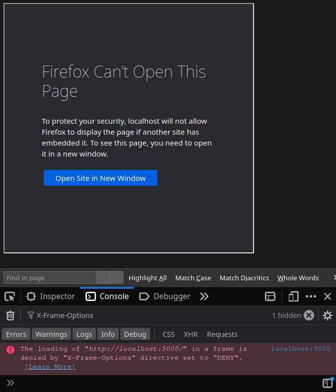{ width=50% }

This shows that the `X-Frame-Options` value of `DENY` prevented loading of the site in a potentially malicious site's `iframe`.

I created a second HTML file `report/double_framing.html`, which attempts to load the first clickjacking attempt's HTML into an `iframe`:

``` html
<html>
  <head>
    <title>Clickjacking Test - Double Framing</title>
  </head>
  <body>
    <iframe src="clickjacking_test.html" width="500" height="500"></iframe>
  </body>
</html>
```

This technique, known as double framing, can get around the frame busting approach to clickjacking protection.
However, it is not able to subvert the `X-Frame-Options` header:

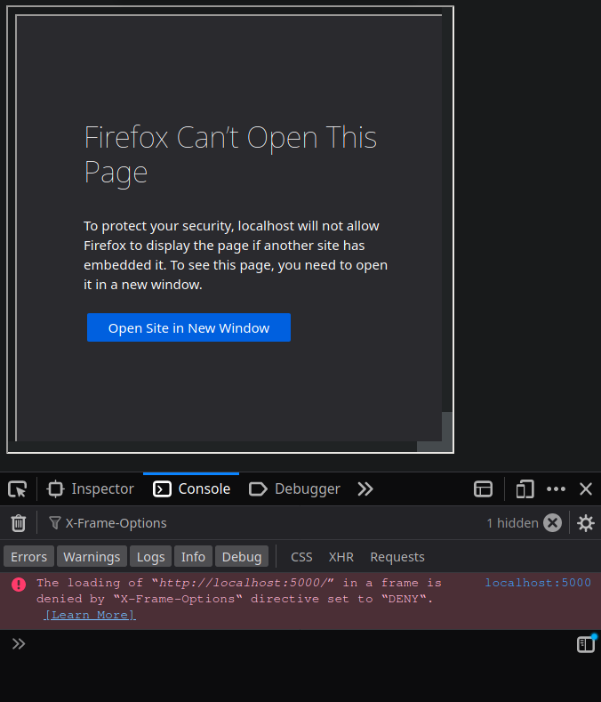{ width=50% }

\newpage

### Cross-Site Request Forgery

Cross-site request forgery occurs when an attacker is able to force a victim to perform an action on a website while the victim is authenticated.
To test for cross-site request forgery vulnerabilities, I created the following HTML `report/csrf_attack.html`:

``` html
<html>
<body onload="document.CSRF.submit()">
  <form action="http://localhost:5000/spell_check" method="POST" name="CSRF">
    <input name="inputtext" type="hidden" value="You have been haaacked!">
  </form>
</body>
</html>
```

The steps in my test were performed in this order:

1. A legitimate user registers and logs in to the Flask server on `localhost:5000`
2. The user submits text to the spell checker and receives a result, to show the user is currently fully authenticated
3. The user opens this HTML file in the tab the legitimate website is currently loaded in, to ensure the user's legitimate cookie is still in memory

If the site is vulnerable to cross-site request forgery, the spell checking will be performed on the text `You have been haaacked!` upon opening the HTML file, and thus without clear consent from the user.

When I performed this test, the end result was the home page as shown to an unauthenticated user:

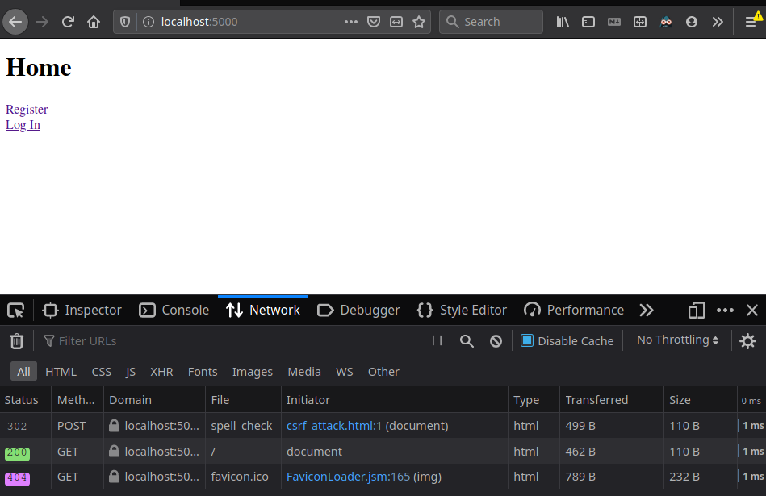{ width=50% }

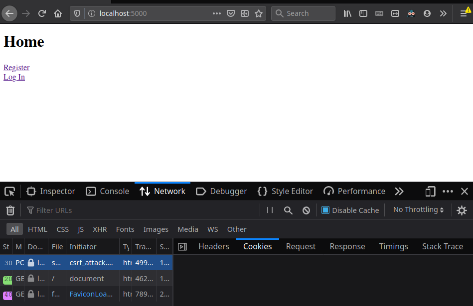{ width=50% }

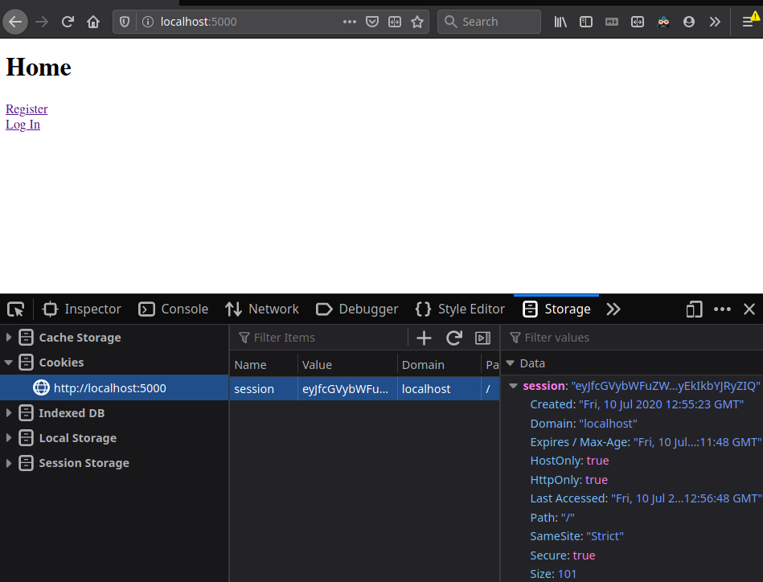{ width=50% }

These screenshots show the `csrf_attack.html` page caused the browser to send a `/spell_check` request to the Flask server.
A cookie was not sent in this request, although there was still a valid cookie in the browser's local storage.
The `SameSite` header of `Strict` set on the cookie prevented the browser from sending the cookie in the request initiated by the `csrf_attack.html` page.
The Flask server did not see a cookie in the request, so the user was ultimately just redirected to the home page.
Upon loading a page from the legitimate website, the user was still authenticated with the cookie and could continue legitimately using the site.

\newpage

### Session Hijacking

In a session hijacking attack, an attacker is able to steal an authenticated user's cookie, either by sniffing network traffic for unencrypted HTTP headers or through a cross-site scripting that sends the user's cookie to the attacker.

Running the Flask server locally transports data over HTTP, so users' cookies can be sniffed at a network level and stolen that way.
However, assuming a proper production server was set up with a valid TLS certificate, cookies would be transported over encrypted HTTPS connections, since the `Secure` cookie heaer is set.
This does not require a code change, rather a more secure server configuration.

My previous attempts at performing cross-site scripting attacks did not expose any such vulnerabilities.
As an additional safety net, the `HttpOnly` cookie header has been set, so the cookie cannot be accessed from JavaScript.
Attempting this through an authenticated user's JavaScript console shows the cookie is not accessible from JavaScript and is safe from any future cross-site scripting vulnerabilities:

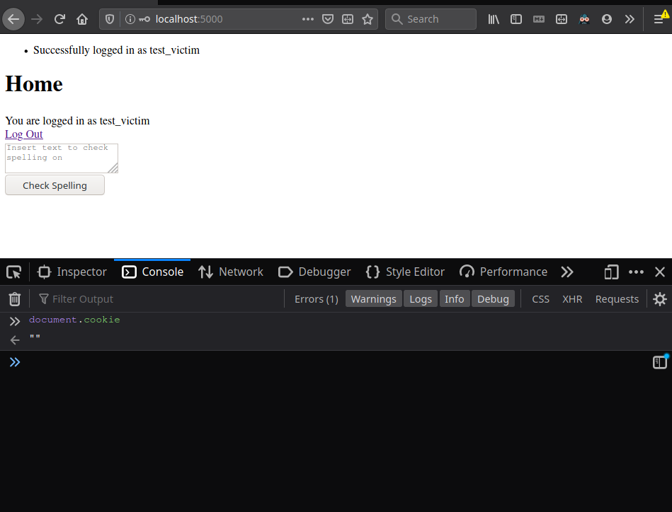{ width=50% }
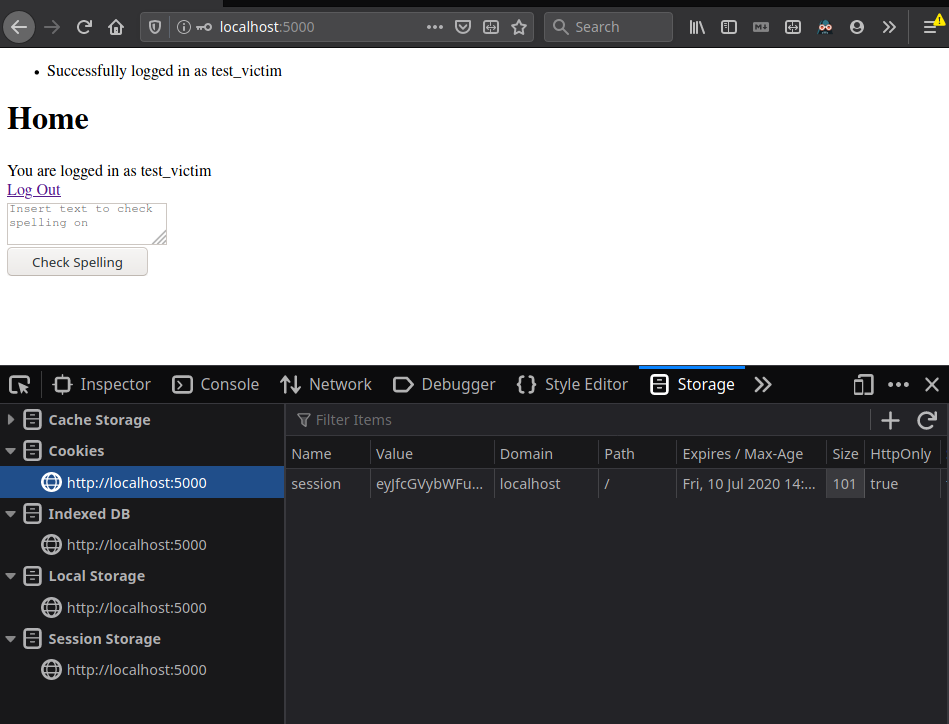{ width=50% }

\newpage

### Session Fixation

A web server is vulnerable to session fixation attacks when a user's previous session is not invalidated when the user creates a new session.
To test for this type of vulnerability, I logged in as the same user in two different browsers to guarantee they would not share cookie storage:

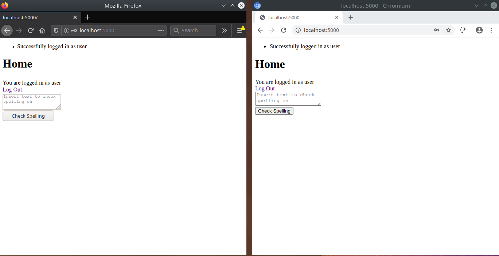

In the screenshot above, I logged in using Firefox in the left window first.
Afterwards, I logged in to Chromium on the right window.

Next, I performed a spell check on both, which can only be performed by authenticated users.

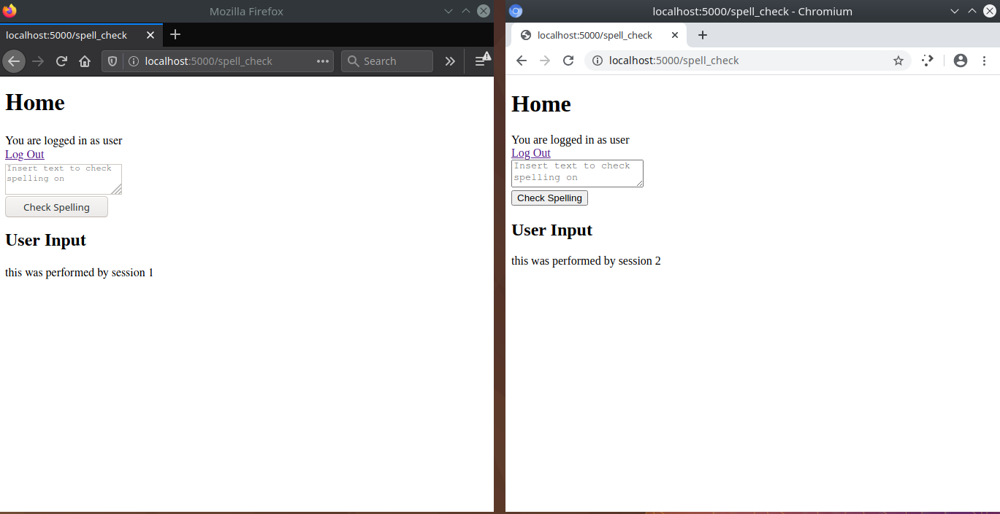

The screenshot above shows that both sessions are still valid, since the spell check was performed for both.
Next, I logged out of the first session then performed a spell check on the second session:

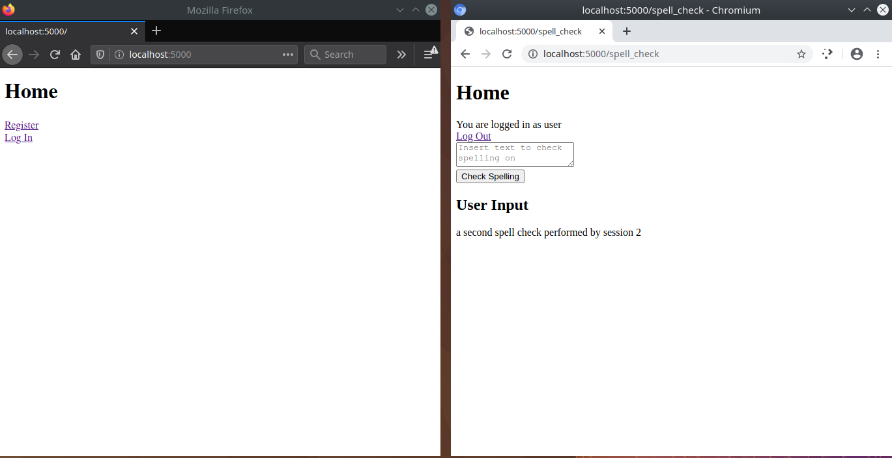

The second spell check succeeded, showing that my server is prone to session fixation attacks.
An attacker can potentially gain access to one session's cookie and stay logged in as the victim user, despite any log in or log out operations performed by the user.
The attacker's session would only become invalidated once the attacker explicitly logs out, or the session expires.
The attacker could easily keep refreshing the session by making authenticated requests to the server, so expiration does not fully solve this problem.

#### Fixing the Vulnerability
\
The root cause of the vulnerability is that the web server allows a single user to be authenticated in multiple sessions at the same time.

See this commit for the fix: [https://github.com/bgottlob/app-sec-assignment2/commit/06e2d58d8c845c69a1aed7707d0e4ae378caaf89](https://github.com/bgottlob/app-sec-assignment2/commit/06e2d58d8c845c69a1aed7707d0e4ae378caaf89)

Storage and tracking of Flask sessions are performed solely on the browser side.
This opened up the opportunity for session fixation, since the server had no way to invalidate an existing session without a well-behaving browser from doing so.
The fix for this was to create a dictionary data structure on the Flask server that tracks each user's session.
It does so by storing a randomly-generated nonce for each session, and storing only one nonce in the dictionary for each authenticated user.
When a user logs in and a new session is created, a new nonce is created and stored against the user's username in the dictionary.
The nonce is stored in the user's session cookie that is sent to the browser.
Checks to determine whether a browser's request is authenticated now adds the condition that the nonce sent in the request's cookie matches the nonce stored for the user in the server-side dictionary.

This has the effect of invalidating any previous sessions for a user when that user logs in, since the server-side nonce will have changed.
I performed the same test, logging in as the same user in two different browsers, logging in using Firefox on the left first then Chromium on the right:

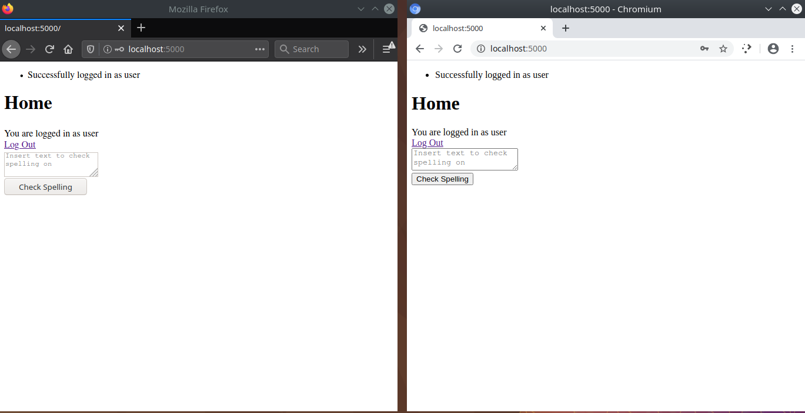

Next, I attempted the spell check with both sessions:

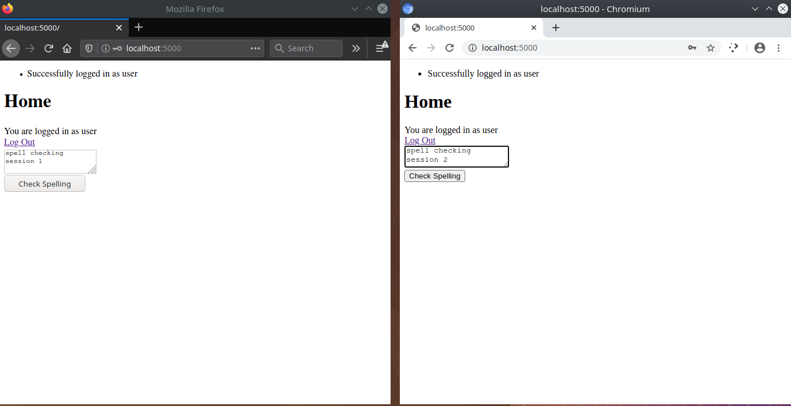

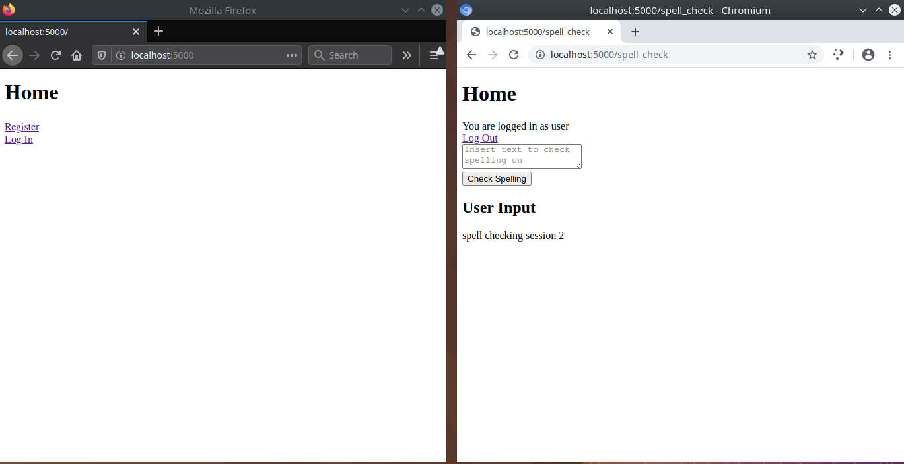

Since I logged in with Chromium after doing so with Firefox, the Firefox session was invalidated and did not perform the spell check.
The server determined the Firefox session was invalid and redirected to the home page.

\newpage

### Linux Command Execution

To test for Linux command execution vulnerabilities, I submitted a Linux command as a registered username and as text to check for spelling, specifically `cat /etc/passwd`.
I tried simply `cat /etc/passwd` and `$(cat /etc/passwd)`:

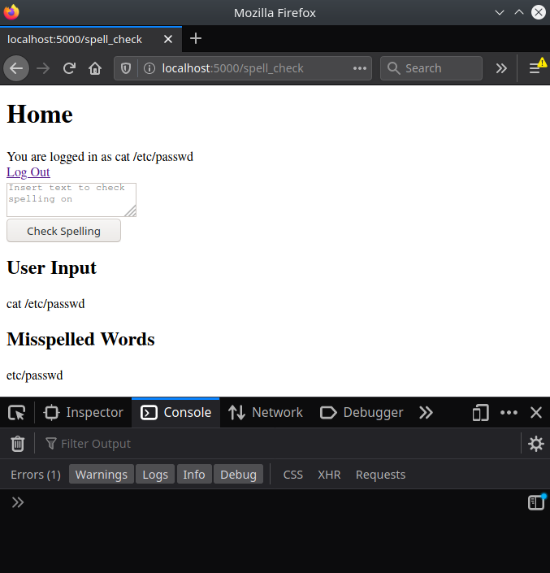{ width=50% }
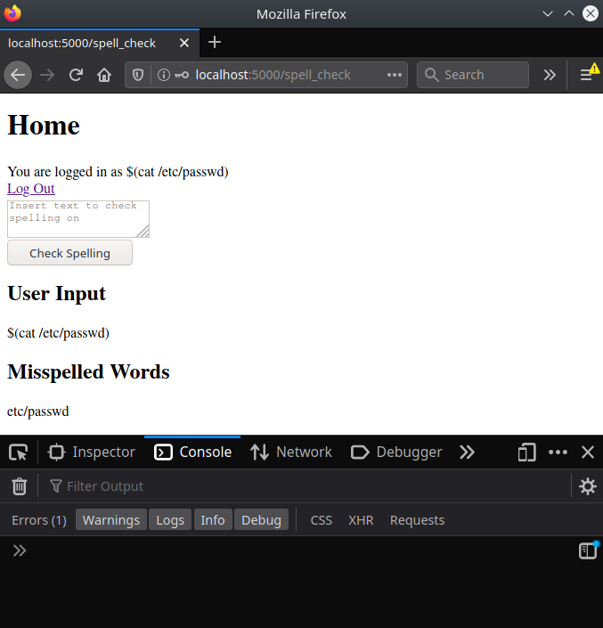{ width=50% }

Linux command vulnerabilities are avoided due to the usage of UUIDs, a trusted string, as filenames interpolated into Linux commands.
