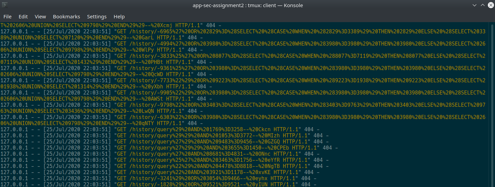
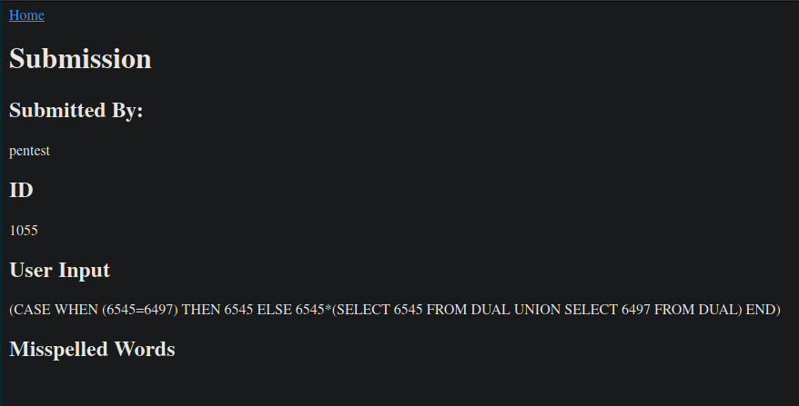
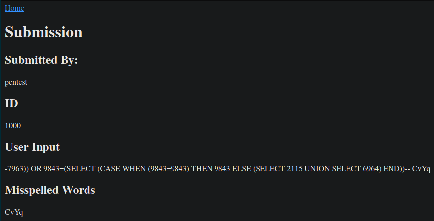
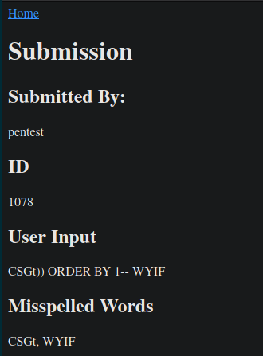
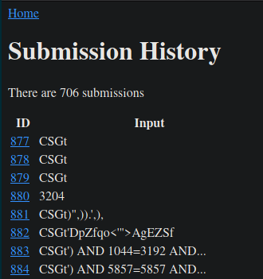
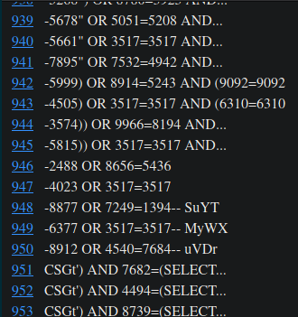

# Assignment 3

## Repository Link

[https://github.com/bgottlob/app-sec-assignment2](https://github.com/bgottlob/app-sec-assignment2)

\noindent
This is the same repository used for assignment 2.
Additional commits have been added to implement assignment 3.
The following link is to a tag for the code submitted as assignment 3:

[https://github.com/bgottlob/app-sec-assignment2/releases/tag/v2.0](https://github.com/bgottlob/app-sec-assignment2/releases/tag/v2.0)

## Database Design

There are three tables in the database: User, AuthSession, and Submission.
The User table manages user data and credentials, and it contains the following columns:

- `id`: an auto-incrementing integer used as the primary key
- `username`: the string username, with a uniqueness constraint
- `password_hash`: a SHA512 hash of the user's password and salt
- `salt`: a string representation of 16 random bytes appended to the user's password before it is hashed
- `mfa`: the multi-factor authentication phone number

Notably, a numeric id is used as the primary key for users instead of the unique username column.
As will be seen in the other tables, the User.id column is used as a foreign key for joins.
Numeric values are more performant when used for joins compared to strings and are cheaper to store as foreign keys in other tables.
Additionally, using a numeric user id will allow for a user's username to be changed without the need to cascade changes to any other tables.
Changing usernames is not a feature in the application, but the schema allows it to be implemented easily.

As in the initial implementation with SQLite, the password is not stored directly.
Rather, the password is appended with a random salt string and is hashed.
Only the hash and the salt needed to verify the hash are stored in the database.

The Submission table manages spell check queries submitted by end users, and it contains the following columns:

- `id`: an auto-incrementing integer used as the primary key
- `text`: the submitted text that is spell-checked
- `result`: a string of comma-separated misspelled words
- `user_id`: foreign key to the `id` column of the User table, indicating which user submitted the query

The AuthSession table manages active user sessions and the logged times to support the login history functionality, and it contains the folowing columns:

- `id`: a randomly-generated UUID4 string to identify a single session, used as the primary key
- `valid`: a boolean flag indicating whether or not the session can still be used to authenticate user requests
- `login_datetime`: a UTC timestamp of when the session began, when the user logged in
- `logout_datetime`: a UTC timestamp of when the session ended, when the user logged out or when the session was invalidated
- `user_id`: foreign key to the `id` column of the User table, representing the user who is authenticated in this session

The most notable design decision is the use of a UUID string as the primary key, instead of an auto-incrementing integer as is for the User table primary key.
Because the session `id` value is sent in the cookie to users' browsers, it is very important that an attacker cannot guess the `id`.
If an attacker knew a user's username and correctly guessed the user's session `id`, the attacker could try to send it to the server in a spoofed cookie to hijack the user's session.
Even if the attacker had this information, the attacker would also need to know the Flask server's secret key to sign the spoofed cookie.
However, it is better to keep client-visible data as obscured and difficult to spoof as possible.
Additionally, since the UUIDs are in a primary key problem, the same UUID cannot be used for multiple sessions.
It is not particularly important for the User and Submission primary keys to be difficult-to-guess UUIDs because the numeric user `id` is never visible to end users and access to submission data is regulated by access control mechanisms.

The `valid` flag simply indicates whether the UUID for the given session can still be used to make authenticated requests for the given user.
As will be described in the next session, this is used to prevent session fixation attacks be verifying only one session can be used to make authenticated requests for each user.

The `valid` flag allows the AuthSession table to manage both active and historical session data.
Adding the login and logout timestamps directly to the AuthSession table made it possible to show active and historical sessions side-by-side in the login history page.
A `NULL` logout timestamp theoretically could indicate that a session is no longer valid, thus making the `valid` column redundant.
However, I separated the logout timestamp and the `valid` flag because they are semantically different concepts, as one is for logging history and the other is for managing the current state of the system.
Logically, it seemed cleaner to use two separate columns although it is redundant.
A single bit is a very low cost to pay in redundancy.

## Application Design Decisions

To protect against SQL injection vulnerabilities, the SQLAlchemy object-relational mapping is used to create the database schema, perform queries, and manipulate data rows.
SQLAlchemy does provide an `execute()` function to execute arbitrary SQL statements, but the application strictly uses the ORM SQL generation functions `query()`, `add()`, and `commit()` to query for and modify data.
These functions utilize SQL prepared statements, which provide injection prevention by escaping special characters.
There are no instances where string interpolation is used to build explicit SQL statements.

As previously mentioned, the `valid` column of the AuthSession table set to `False` in order to invalidate sessions.
Whenever a user logs out, all of that user's sessions are invalidated
When a session is invalid the logout timestamp is set.
This means that the presence of a logout timestamp does not necessarily mean the user manually logged out.
The intention of the logout timestamp is to track when the session became invalid and no longer usable, rather than strictly tracking user activity.
This behavior allows for up to one of a user's sessions to have a `valid` flag set to `True`, preventing session fixation vulnerabilities.

Besides limiting a user's query history limited to each specific authenticated user, this application supports admin level access.
For simplicity from a database design perspective, the admin user is uniquely identified by the User table row with a username of `admin`.
Upon database creation, the admin account is also created.
This, in conjunction with the username uniqueness constraint prevents end users from creating admin accounts.
An `is_admin()` function has been implemented to serve as admin access control by checking whether an authenticated user's username is `admin`.
Clearly, this does not support the ability to create multiple admin accounts.
However, the use of `is_admin()` throughout the application allows for the underlying implementation of that function to be updated to support multiple admins without changing every part of application code where this access control check is performed.

## SQL Injection Attempts

SQLMap was used to perform penetration testing for SQL injection vulnerabilities.
The following endpoint and methods have been tested:

- POST `/register`
- POST `/login`
- POST `/spell_check` (requires authentication)
- POST `/history` (requires admin authentication for username search)
- GET `/history/query<id>` (requires authentication)
- POST `/login_history` (requires admin authentication)

This includes all POST forms in the application, as well as the only GET that accepts a query parameter.

For all endpoints that require the end user to be authenticated, the `--level` option to sqlmap, which attempts to perform SQL injection on HTTP cookie header values.
To simulate an authenticated user, a cookie pulled from an authentication session will be passed to sqlmap.
For all POST endpoints, the forms in the UI are automatically detected using the `--form` option.

All endpoints were tested with a `--risk` option of 3, which is the maximum value.
This high level of "risk" means that the injection attacks attempted can potentially corrupt many records in the database.
Since there is no fear of detection and no critical data that cannot easily be regenerated in the database, the maximum risk level can be used.
The `--dbms` option is set to SQLite, since it is known beforehand that SQLite is used, and the penetration test does not need to waste time trying injection attacks for specific DBMS platforms that are not used.

### Results

I was not able to find any SQL injection vulnerabilities by using sqlmap.
Below contains logs for the POST fields, URL parameters, and cookie parameters tested by sqlmap, all of which were not found to be injectable:

```
heuristic (basic) test shows that URI parameter '#1*' might not be injectable
URI parameter '#1*' does not seem to be injectable
heuristic (basic) test shows that POST parameter 'userquery' might not be injectable
POST parameter 'userquery' does not seem to be injectable
heuristic (basic) test shows that Cookie parameter 'session' might not be injectable
Cookie parameter 'session' does not seem to be injectable
heuristic (basic) test shows that Cookie parameter 'Expires' might not be injectable
Cookie parameter 'Expires' does not seem to be injectable
heuristic (basic) test shows that Cookie parameter 'Path' might not be injectable
Cookie parameter 'Path' does not seem to be injectable
heuristic (basic) test shows that Cookie parameter 'SameSite' might not be injectable
Cookie parameter 'SameSite' does not seem to be injectable
heuristic (basic) test shows that POST parameter 'userid' might not be injectable
POST parameter 'userid' does not seem to be injectable
heuristic (basic) test shows that Cookie parameter 'session' might not be injectable
Cookie parameter 'session' does not seem to be injectable
heuristic (basic) test shows that Cookie parameter 'Expires' might not be injectable
Cookie parameter 'Expires' does not seem to be injectable
heuristic (basic) test shows that Cookie parameter 'Path' might not be injectable
Cookie parameter 'Path' does not seem to be injectable
heuristic (basic) test shows that Cookie parameter 'SameSite' might not be injectable
Cookie parameter 'SameSite' does not seem to be injectable
heuristic (basic) test shows that POST parameter 'uname' might not be injectable
POST parameter 'uname' does not seem to be injectable
heuristic (basic) test shows that POST parameter 'pword' might not be injectable
POST parameter 'pword' does not seem to be injectable
heuristic (basic) test shows that POST parameter '2fa' might not be injectable
POST parameter '2fa' does not seem to be injectable
POST parameter 'uname' does not seem to be injectable
POST parameter 'pword' does not seem to be injectable
POST parameter '2fa' does not seem to be injectable
```

For the GET `/history/query<id>` sqlmap tests, I tested SQL injection both with and without the URL having the `query` prefix before the provided id.
Below is a screenshot of these tests yielding 404 Not Found errors resulting from the injection attempts:



The following screenshots demonstrate some of the inputs used to test the POST `/spell_check` endpoint:










